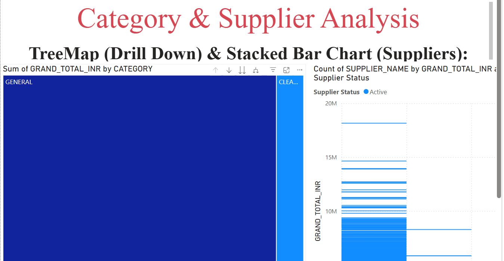
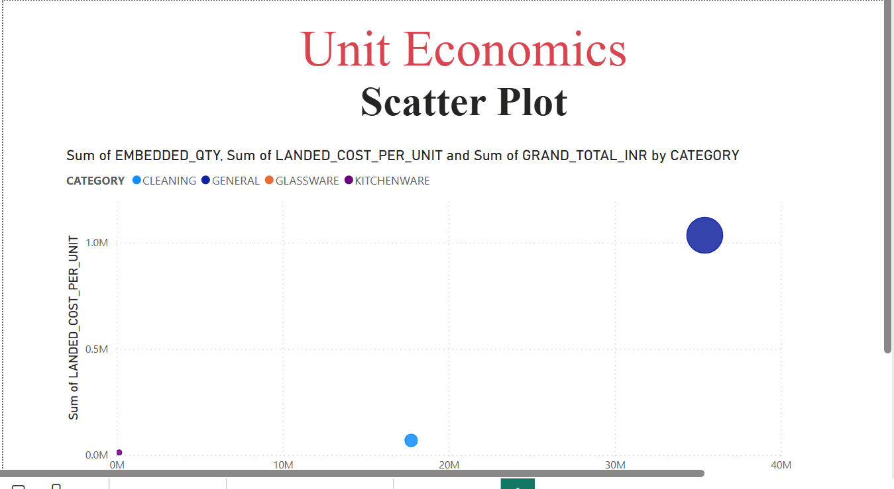

International Trade Data Analysis & Pipeline

📌 Project Overview

Siddharth Associates Assignment

This project migrates a manual, Excel-based trade analysis workflow into a scalable, automated data pipeline. It processes raw international shipment data (2017–2025) to extract granular insights on Landed Costs, Supplier Churn, and Macro Economic Trends.

Tech Stack:

Python (Pandas, Regex): For ETL, advanced text parsing, and feature engineering.

SQLite: For structured data storage and querying.

Power BI: For interactive visualization and reporting.

📂 Project Structure

siddharth_trade_pipeline/
├── data/
│   ├── raw/                      # Place raw Excel/CSV files here
│   └── processed/                # Output folder for processed_trade_data.csv
├── notebooks/                    # Jupyter Notebooks for experimentation
│   ├── 01_data_inspection.py
│   ├── 02_parsing_and_cleaning.py
│   └── 03_feature_engineering.py
├── src/                          # Source code modules
│   ├── cleaning/
│   │   └── clean_base.py         # Unit standardization & cleaning logic
│   ├── parsing/
│   │   └── parse_goods_description.py # Regex extraction for Description
│   ├── feature_engineering/
│   │   └── features.py           # Landed cost & Synthetic Supplier logic
│   └── db/
│       └── load_to_db.py         # SQLite loading scripts
├── sql/                          # SQL Queries for analysis
│   ├── schema.sql
│   ├── macro_trends.sql
│   ├── pareto_hsn.sql
│   └── supplier_analysis.sql
├── dashboards/                   # Power BI files
│   └── Trade_Analysis_Dashboard.pbix
├── docs/                         # Documentation
│   └── 
├── main.py               # Main entry point to execute the pipeline
└── README.md
|__ requirements.txt

⚙️ Setup & Installation

1. Prerequisites

Ensure you have Python 3.8+ installed.

2. Install Dependencies

Run the following command to install the required libraries:

pip install pandas numpy sqlalchemy openpyxl

3. Data Setup

Place your raw data file (e.g., Siddharth_Associates_sample data 2.xlsx - Sheet1.csv) inside the root directory or data/raw/ folder.

🚀 How to Run the Pipeline

To execute the full cleaning, parsing, and engineering workflow, run the main script:

python run_pipeline.py

What this script does:

Cleaning (src/cleaning/clean_base.py): Loads raw data, fixes date formats, and standardizes units (e.g., converts 'NOS', 'PIECES' to 'PCS').

Parsing (src/parsing/parse_goods_description.py): Uses Regex to extract Model, Material, Embedded Quantity, and USD Price from the unstructured Goods Description.

Feature Engineering (src/feature_engineering/features.py):

Calculates Landed Cost Per Unit (Total Value + Duty / Qty).

Assigns Categories (Kitchenware, Glassware, etc.) based on keywords.

Synthetic Supplier Generation: Since the raw data lacks supplier names, the script generates deterministic supplier names (e.g., "Global Supplier Group-1") based on product descriptions to enable churn analysis.

Export:

Saves a clean CSV to processed_trade_data.csv.

Loads data into a local SQLite database trade_analysis.db.

📊 SQL Analysis

You can run the queries located in the sql/ folder against the generated trade_analysis.db.

Macro Trends: Year-over-Year growth calculation using Window Functions.

Pareto Analysis: Identifies the top 25 HSN codes driving 80% of value.

Supplier Status: Segments suppliers into "Active" (sold in 2025) vs "Churned".

📈 Power BI Dashboard Guide

The dashboard (dashboards/Trade_Analysis_Dashboard.pbix) connects to the processed CSV and provides three key views:

1. Macro Dashboard

Trends: Line chart of Total Imports vs. Duty Paid (2017–2025).

Heatmap: Year-over-Year growth % (Red = Negative, Green = Positive).

Note: Uses a custom DAX measure for robust YoY calculation on sparse dates.

2. Category & Supplier Analysis

Drill-Down: TreeMap allowing navigation from Category → Sub-Category → Model.

Supplier Churn: Visualizes active vs. inactive suppliers using the synthetic supplier logic.

3. Unit Economics

Scatter Plot: Correlates Quantity Purchased with Landed Cost Per Unit to identify economies of scale and procurement anomalies.

📝 Key Design Decisions

Regex Extraction: The Goods Description was unstructured. We used specific regex patterns (USD\s*([\d\.]+)) to reliably extract pricing hidden in text.

Landed Cost: We prioritized "Landed Cost" over simple Unit Price to account for the high variance in Customs Duty (10% vs 50%).

Synthetic Data: To fulfill the assignment requirement for "Supplier Analysis" in the absence of a raw supplier column, we implemented a hashing algorithm to consistently assign products to synthetic supplier groups.

👤 Author

Siddharth Associates Candidate - Sujith Sridhar
Pipeline created for Technical Assignment.